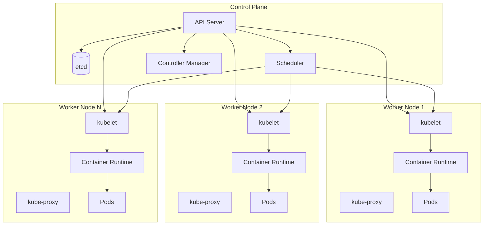
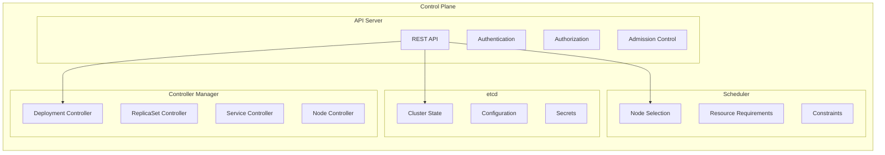
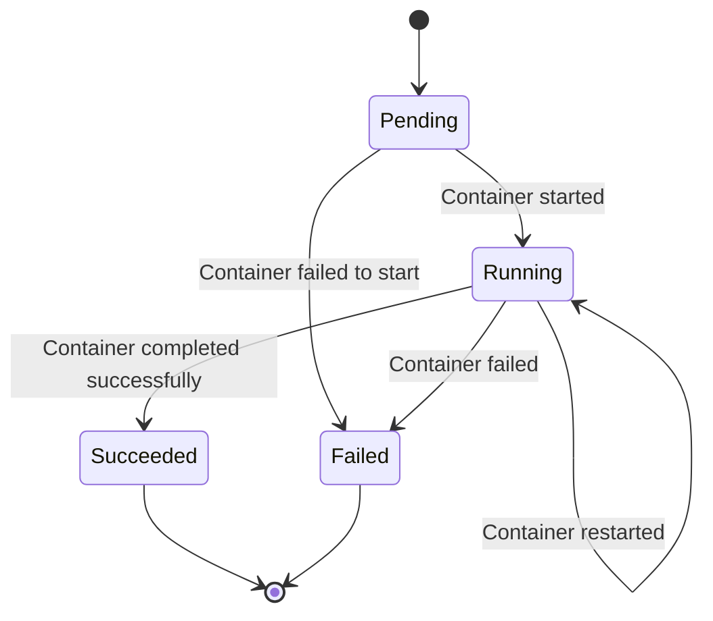
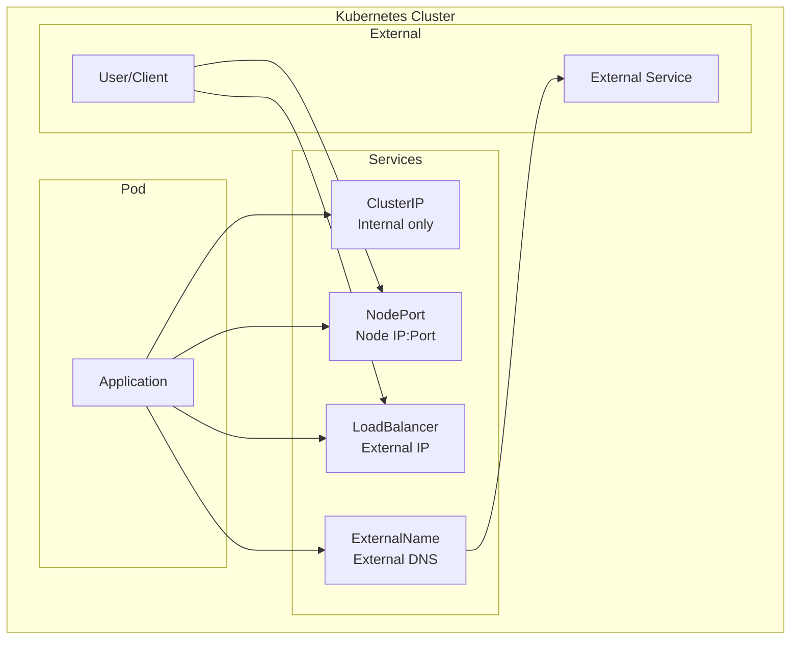
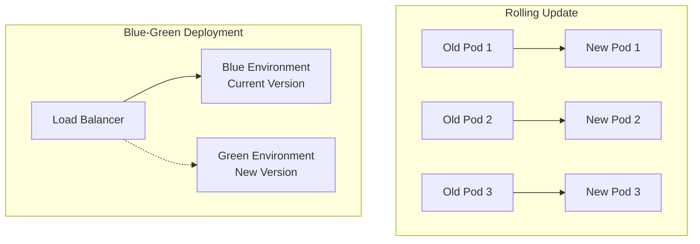
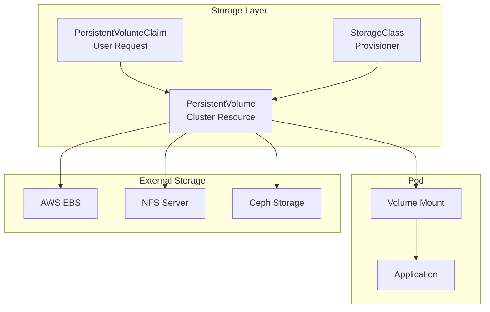
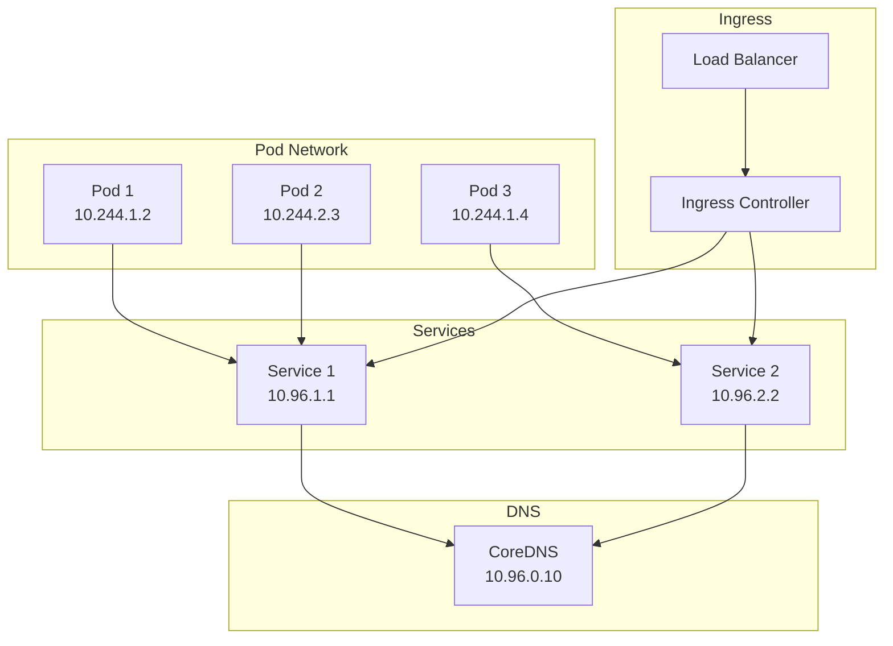
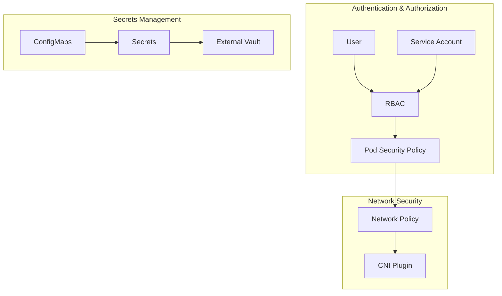
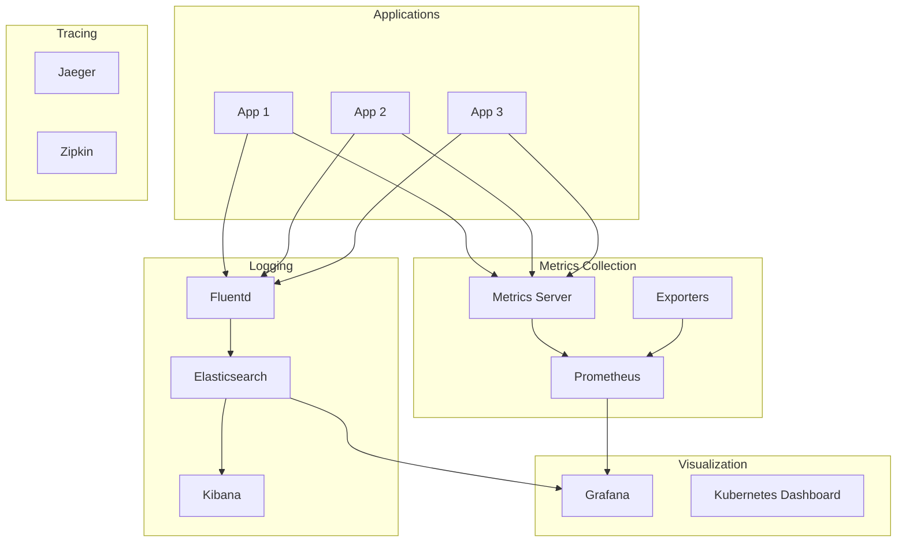

# 🏗️ Kubernetes Architecture Diagrams

## **Kiến trúc tổng quan Kubernetes**

## **Chi tiết Control Plane Components**

## **Pod Lifecycle**

## **Service Types**

## **Deployment Strategy**

## **Storage Architecture**

## **Network Architecture**

## **Security Architecture**

## **Monitoring & Observability**

## **Cách sử dụng diagrams**

1. **Copy code Mermaid** từ các diagram trên
2. **Paste vào** [Mermaid Live Editor](https://mermaid.live/)
3. **Hoặc sử dụng** VS Code với Mermaid extension
4. **Hoặc tích hợp** vào documentation tools

## **Lưu ý quan trọng**

- **Control Plane**: Quản lý cluster state và scheduling
- **Worker Nodes**: Chạy applications và workloads
- **Pods**: Đơn vị nhỏ nhất có thể deploy
- **Services**: Cung cấp stable network endpoint
- **Volumes**: Persistent storage cho applications
- **Security**: Multi-layer security với RBAC, Network Policies
- **Monitoring**: Comprehensive observability stack
